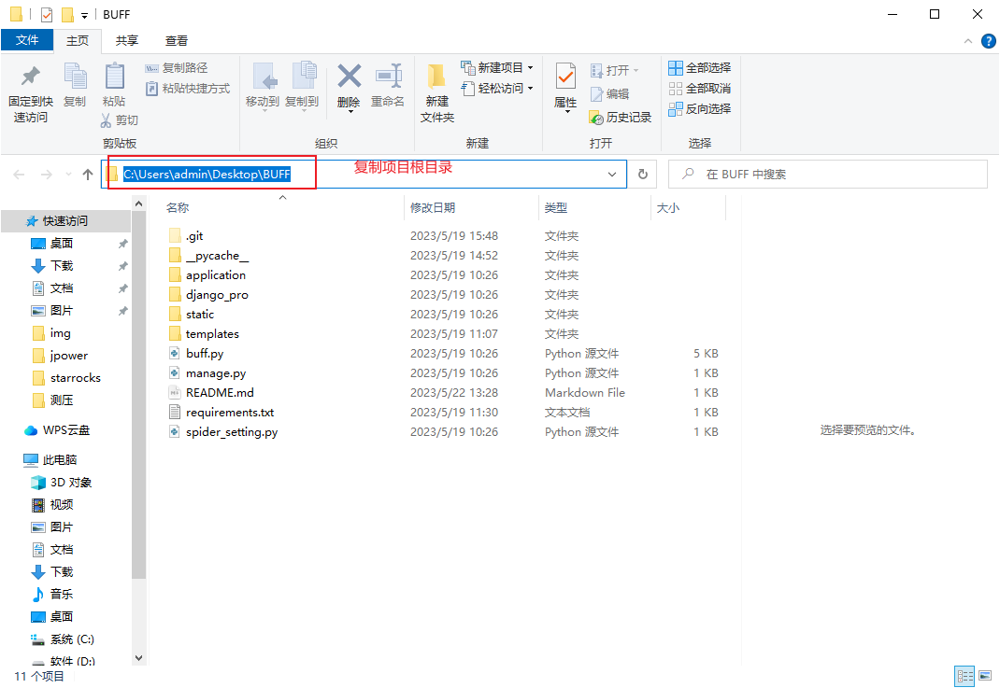
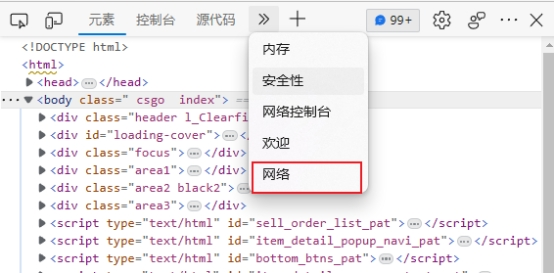
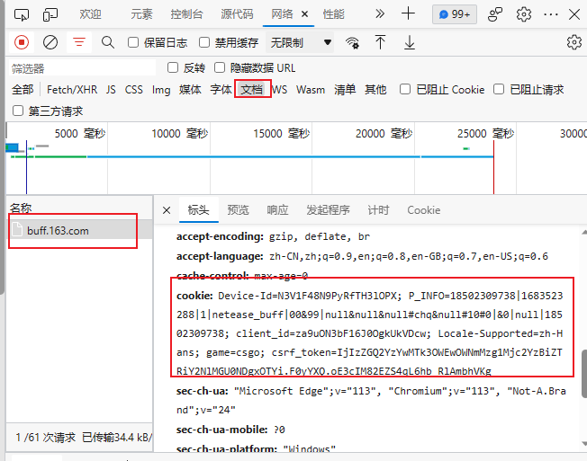

# CSGO数据分析系统

### 一、使用技术

#### 1.1 Django

​	该框架主要为项目提供web后端服务。

​	Django 是一个由 Python 编写的一个开放源代码的 Web 应用框架。使用 Django，只要很少的代码，Python 的程序开发人员就可以轻松地完成一个正式网站所需要的大部分内容，并进一步开发出全功能的 Web 服务 Django 本身基于 MVC 模型，即 Model（模型）+ View（视图）+ Controller（控制器）设计模式，MVC 模式使后续对程序的修改和扩展简化，并且使程序某一部分的重复利用成为可能。

[Django 文档 | Django 文档 | Django (djangoproject.com)](https://docs.djangoproject.com/zh-hans/4.2/)

#### 1.2 echarts

​	echarts主要为项目提供图表绘制和自定义图表的功能。

​	ECharts 是一个使用 JavaScript 实现的开源可视化库，涵盖各行业图表，满足各种需求。ECharts 遵循 Apache-2.0 开源协议，免费商用。ECharts 兼容当前绝大部分浏览器（IE8/9/10/11，Chrome，Firefox，Safari等）及兼容多种设备，可随时随地任性展示。

[Apache ECharts](https://echarts.apache.org/zh/index.html)

#### 1.3 MySQL

​	MySQL主要作为项目的实时数据库，存储项目的数据资源。

​	MySQL是一个**[关系型数据库管理系统](https://baike.baidu.com/item/关系型数据库管理系统/696511?fromModule=lemma_inlink)**，由瑞典[MySQL AB](https://baike.baidu.com/item/MySQL AB/2620844?fromModule=lemma_inlink) 公司开发，属于 [Oracle](https://baike.baidu.com/item/Oracle?fromModule=lemma_inlink) 旗下产品。MySQL 是最流行的[关系型数据库管理系统](https://baike.baidu.com/item/关系型数据库管理系统/696511?fromModule=lemma_inlink)之一，在 [WEB](https://baike.baidu.com/item/WEB/150564?fromModule=lemma_inlink) 应用方面，MySQL是最好的 [RDBMS](https://baike.baidu.com/item/RDBMS/1048260?fromModule=lemma_inlink) (Relational Database Management System，[关系数据库管理系统](https://baike.baidu.com/item/关系数据库管理系统/11032386?fromModule=lemma_inlink)) 应用软件之一。

[MySQL官网](https://www.mysql.com/)

#### 1.4 Python

​	项目的爬虫模块、数据存储模块、数据分析模块、后端模块都是使用的python语言

[python官网](https://www.python.org/)

### 二、运行环境

#### 2.1 python下载

https://zhuanlan.zhihu.com/p/569019068

#### 2.2 下载python第三方库

* 复制项目根目录地址



* 按下win+r，输入cmd打开控制台


* 输入cd + 刚刚复制的地址


* 安装第三方库

> 输入下面指令等待执行完成

```
pip install -r requirements.txt -i https://mirrors.aliyun.com/pypi/simple/ 
```

#### 2.3 配置项目配置文件

​	项目的配置文件是spider_setting.py这个文件，里面可以配置爬虫的cookie和数据库连接的参数


#### 2.4 cookie获取

​	因为反爬机制，爬虫需要登录，这里采用的cookie登录，按下面步骤获取cookie后，粘贴在配置文件的cookies（spider_setting.py）即可 

* 进入[网易BUFF游戏饰品交易平台_DOTA2饰品交易,CSGO饰品皮肤交易,RUST饰品交易 (163.com)](https://buff.163.com/)


 

*  登录网站(必须登录)

* F12或者鼠标右键检查


 

* 找到网络进入



 

* 进入后刷新网页，点击筛选器里的文档，找到buff.163.com，然后在请求标头里复制cookie的值（buff是10天更新一次cookie，意思是十天就需要换一次cookie）



### 三、运行项目

* 如2.2进入项目根目录步骤，进入项目根目录
* 输入爬虫模块命令，等待执行完成（每天执行一次，速度设置得很慢防止封号）

```
python buff.py
```
* MySQL添加表主键bid
```
use buff;
alter table BUFF add bid int(11) primary key AUTO_INCREMENT;
alter table BUFF auto_increment=1;
```
* 输入前端模块运行指令

```
python manage.py migrate
python manage.py runserver
```

* 打开控制台返回的链接


